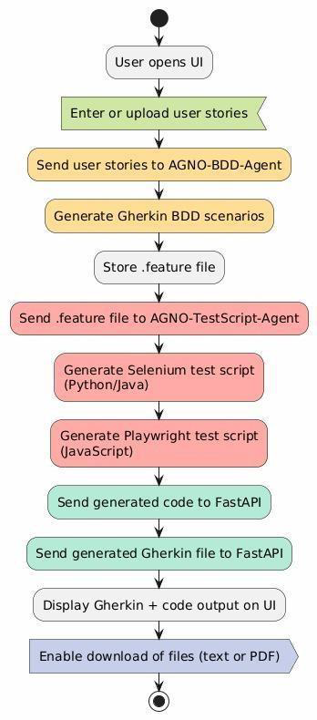
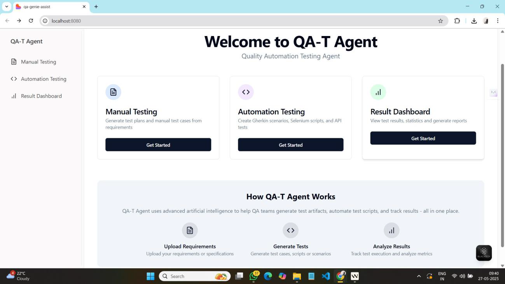
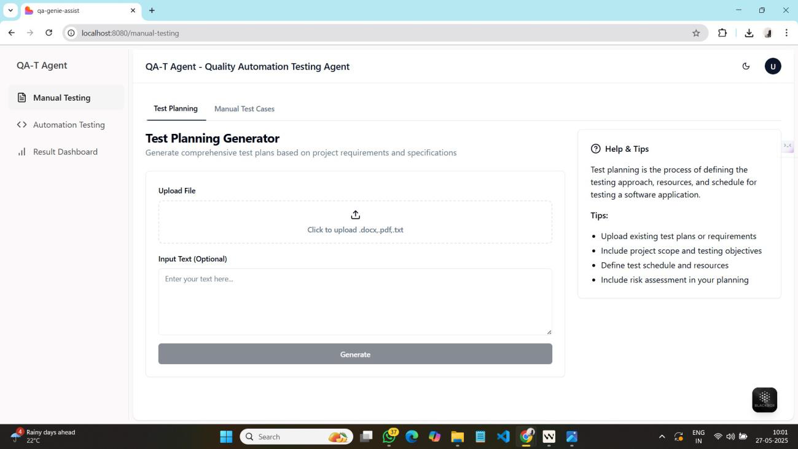
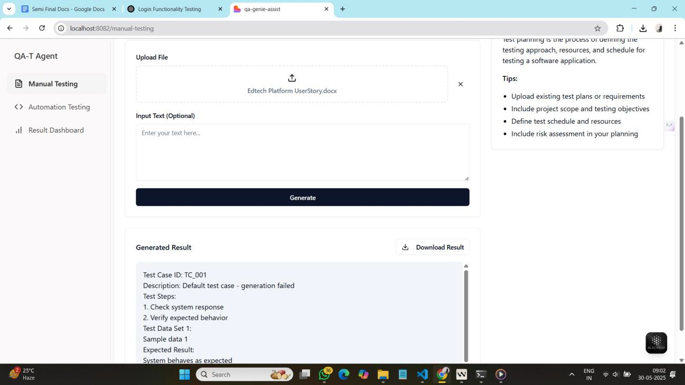
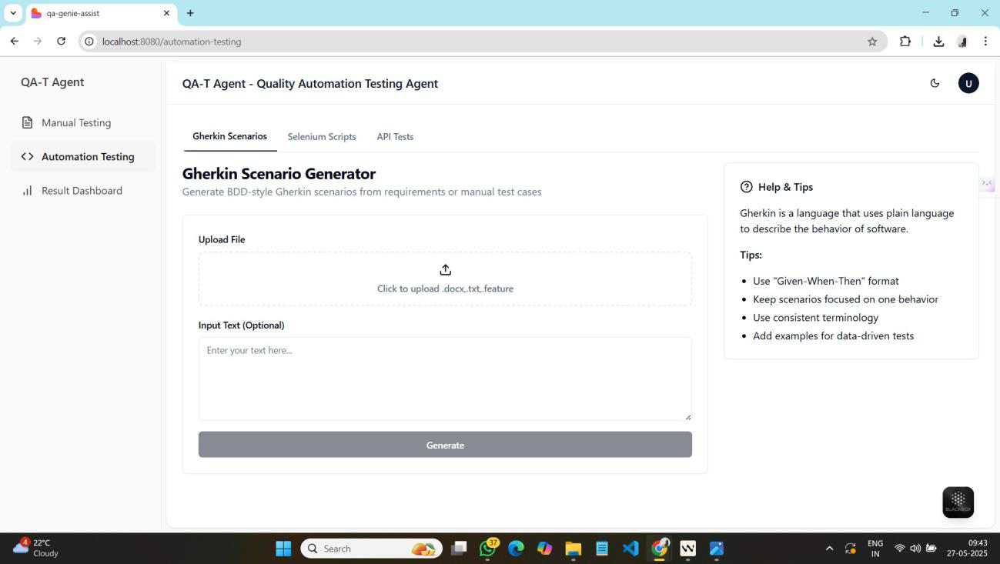
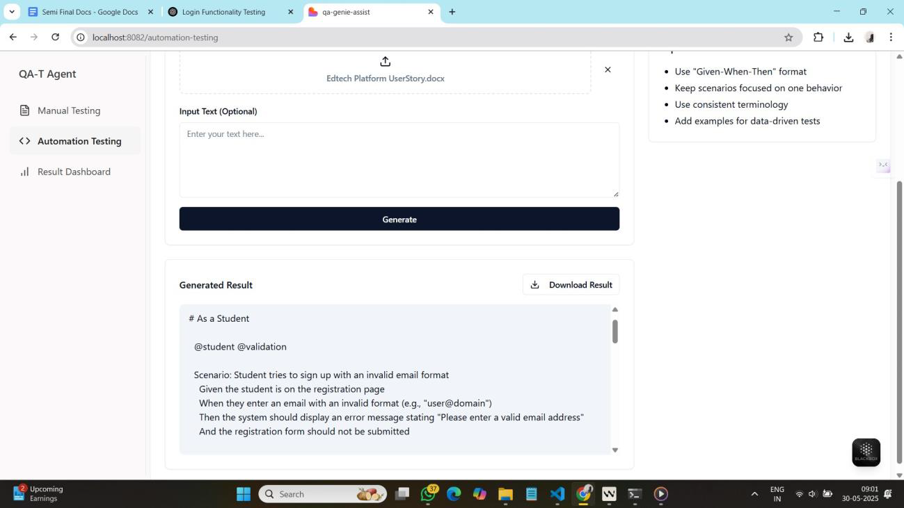
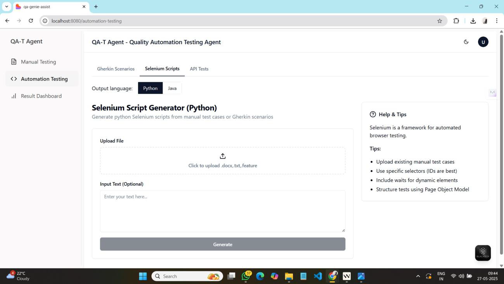
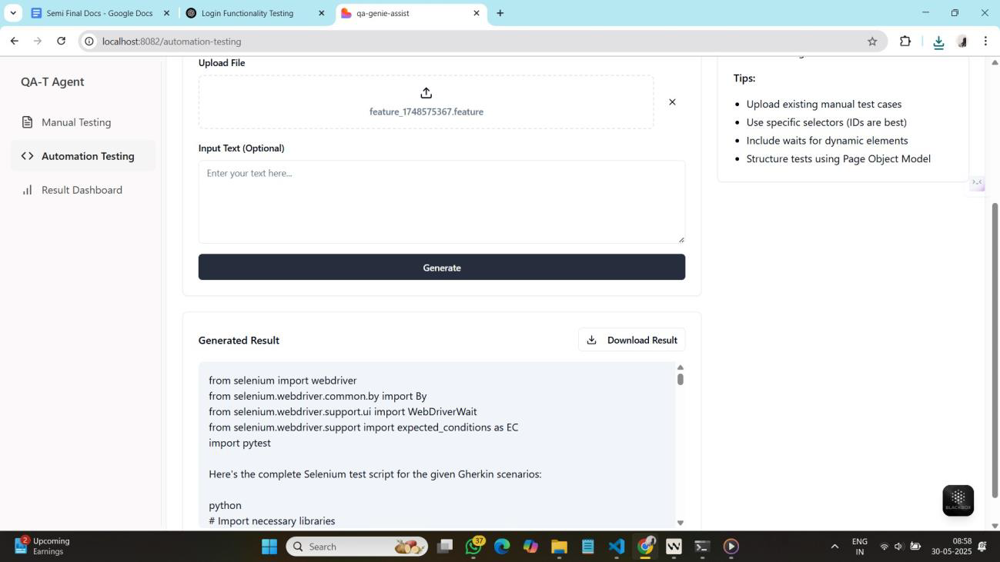

# Project Title
AI Powered QA Test Generation Platform using Agno

## Overview of the Idea
The Project aims to develop automatic Quality Assurance agent in a scrum environment
It has various capabilities like
- to generate BDD from the user story
-generate test script in the Selenium for testing purpose for Frontend, Backend, API, Database

## Project Goal
Project aims to reduce the manual efforts of testing Process in the Scrum environment by automating the Test Procedure using Agno Agents.

## How It Works
This system automates the generation of test artifacts such as Gherkin feature files, Selenium scripts, and manual test cases based on user input or uploaded requirement files. It is built on a modular architecture consisting of a central Agent Router, multiple specialized Test Generator Agents, and a React-based Frontend Interface. Here’s a step-by-step breakdown of how it works:

- **User Flow**
1. Initial Interaction: User navigates to the web interface
2. Input Provision: User can either:
    - Enter requirements directly in a text field
    - Upload a file containing requirements (supports various formats)
3. Configuration Selection: User selects
    - Generator type (Gherkin or Manual Test Cases)
    - Optional settings like language preference
4. Generation Process: User clicks "Generate" button and waits for  processing
5. Results Review: Complete results are displayed on the UI (synchronous response) 
6. Download: User can download the generated Gherkin feature files or test cases

- **Core Functionality**
1. Gherkin Feature Generation:
    - Transforms user stories/requirements into BDD Gherkin syntax
    - Creates comprehensive feature files with scenarios and steps
    - Handles multiple user stories in a single input
    - Supports chunking for large inputs to ensure complete processing
2. Manual Test Case Generation: (under development)
    - Creates structured manual test cases from requirements
    - Includes test steps, test data variations, and expected results
3. File Processing
    - Extracts text from uploaded documents
    - Handles large files through intelligent chunking
    - Preserves document structure when possible
4. Synchronous Processing:
    - Processes requests immediately and returns complete results
    - Ensures frontend receives full output without requiring polling
5. Result Management:
    - Saves generated files on the server
    - Provides download functionality for generated artifacts
    - Displays formatted output directly in the UI

- **Multimodal Elements** 

1. Text Input/Output:
    - Text field for direct requirement entry
    - Formatted display of generated Gherkin/test cases
    - Downloadable text files (.feature, .csv)

## Tools Used
Backend Technologies
    1. FastAPI - Python web framework for building the API endpoints
    2. Agno Agent Framework - For creating and managing the AI agents
    3. Groq LLM Integration - Using deepseek-r1-distill-llama-70b model for test generation
    4. Tiktoken - For token counting and management
    5. Uvicorn - ASGI server for running the FastAPI application

Frontend Technologies
    1. React - For building the user interface
    2. Axios - For making HTTP requests to the backend API

## UI Approach
1. Intro Page – Agent Introduction
    - The landing page introduces various intelligent agents   integrated into the system.From here, the user can navigate to different features.Currently, the platform offers three core features

2. Manual Testing
    a. Test Planning (under development)
        - Users can input project requirements, available manpower, time constraints, and other relevant parameters.
        - The system automatically generates a detailed Test Plan based on the inputs.

    b. Manual Test Cases (under development)
        - This module provides structured test cases and corresponding test data specifically for manual testing processes
3.  Automation Testing
    a. Gherkin Generator
        - Converts user stories into Gherkin syntax following Behavior-Driven Development (BDD) principles
        - Helps bridge the gap between business requirements and automated scripts.
    b. Selenium Script Generator
        - Generates Selenium automation scripts.
        - Currently supports Python (Java support planned for future updates).
        - Helps automate UI-based test scenarios.
    c. API Testing Automation(under development)
        - Enables automated API test generation and execution.
        - Supports functional validation of RESTful APIs (more integrations coming soon).

## Visuals

introduction page

gherkin generator

Selenium script generator

## Team Information
- **Team Lead**: @LostZoro56 - frontend Dev & AIML enthusiast
- **Team Members**: @swatiVibhute20 - AI/ML Practitioner @Yashada24 - Junior AI/ML Developer 
- **Background/Experience**: Experienced in Python backend development, LLM integration, and test automation engineering.

## Prize Category (leave blank, to be assigned by judges)
- [ ] Best use of Agno
- [ ] Best use of Firecrawl
- [ ] Best use of Mem0
- [ ] Best use of Graphlit
- [ ] Best use of Browser Use
- [ ] Best use of Potpie
- [ ] Best Overall Project

## Demo Video Link
(https://drive.google.com/drive/folders/1DkiUC5RLCyHGAzZQdbiIfExrlvAbVbg6)

## Additional Notes

